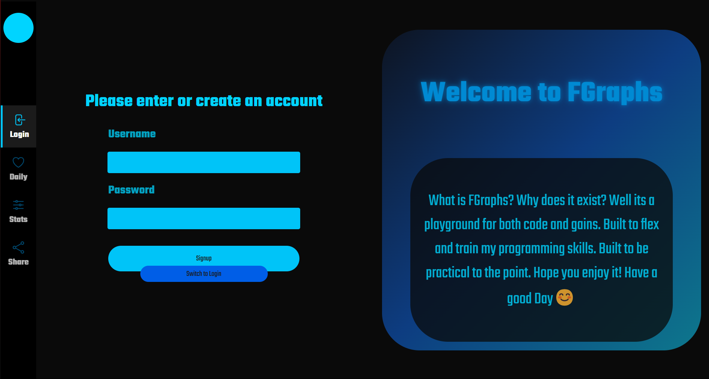
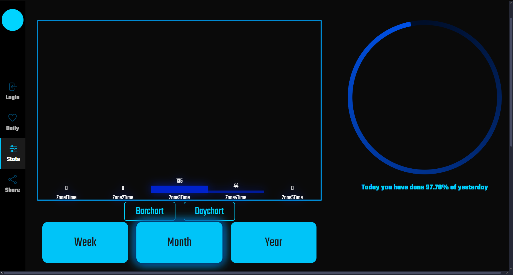
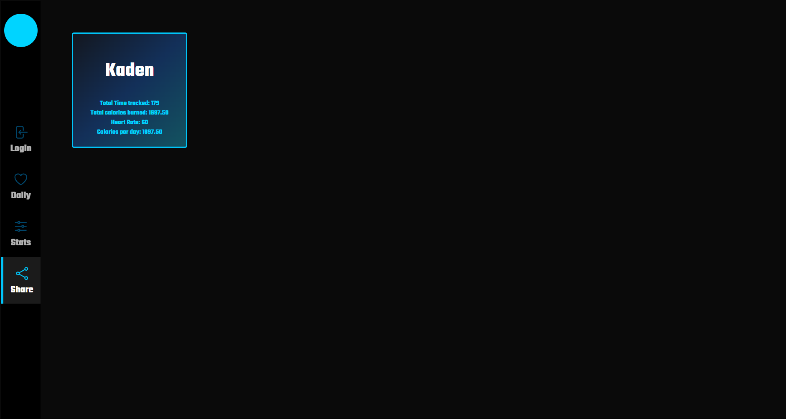

### Fgraphs
A lightweight fitness application. I built this to be actually useful and something I could see myself using when I got started. It's also its own sort of training area for me to evolve my skills in web development.

## Where its going 
Currently my plan for expansion is as follows: better data visualization for users, more responsive UI, optimizations to frontend and backend. And that's pretty much it. I might add more features but currently I think about it as a product and culmination of my skills in the web. Still has a long way to go though!

## Tech Stack
- **Frontend**: React, Javascript
- **Backend**: Express, Mysql, sequalize 
- **Styling**: D3, AnimeJs(not implemented yet)
- **Hosting**: AWS's EC2 instance
- **Build tool**: Vite

## Features
- **Data visualization & metrics**: Show estimates and statistical improvement based on data the user has given and display's them
- **Data sharing**: Able to share your data with other user's if desired
- **Interesting UI**: Custom design in figma using colors that match well and a interactive and interesting UI.

## Link
www.fgraphs.com 

## ScreenShots

  
  
  

